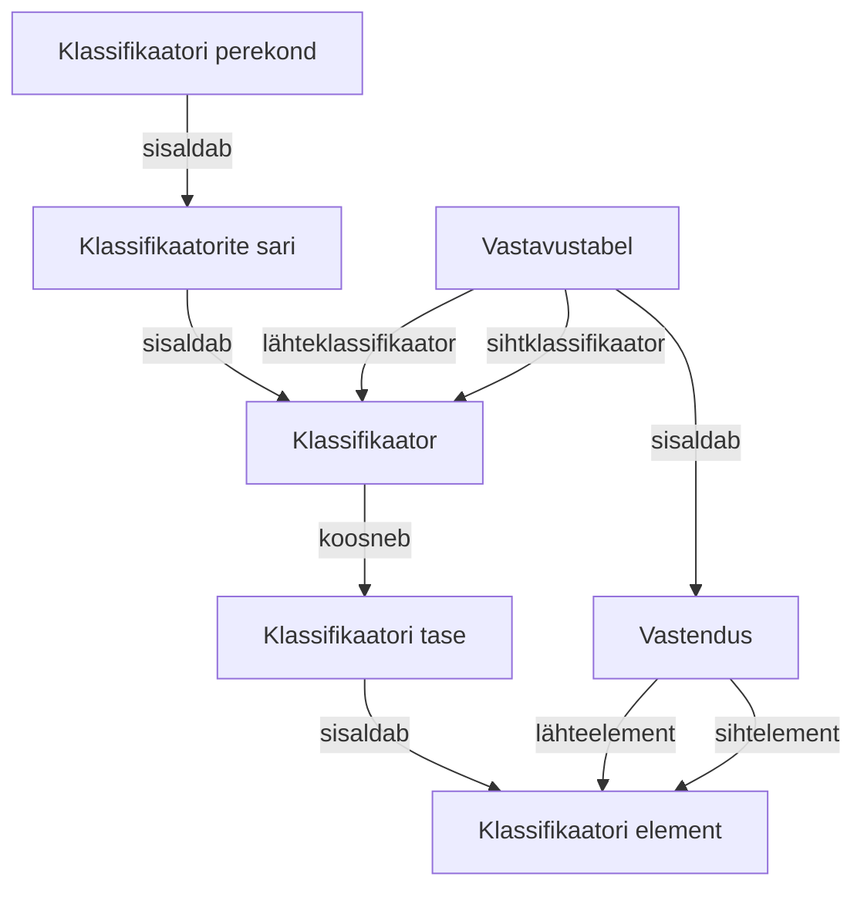
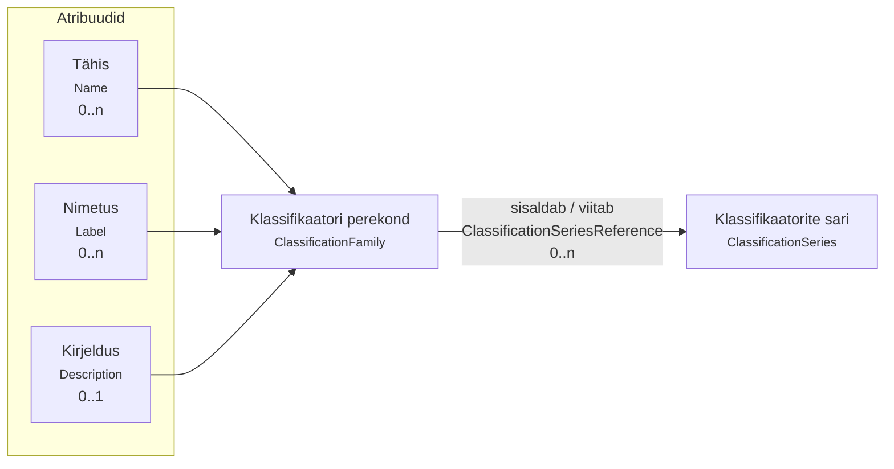
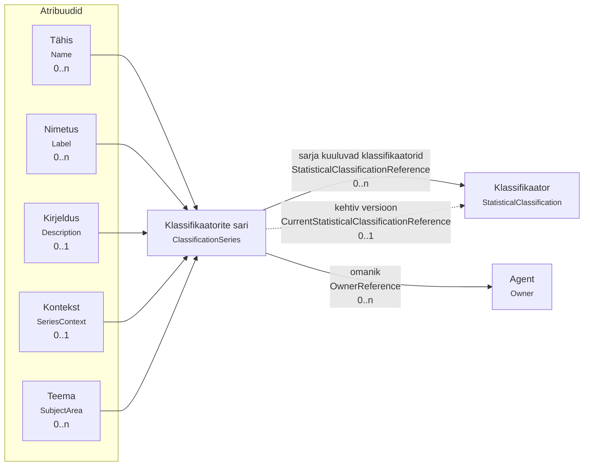
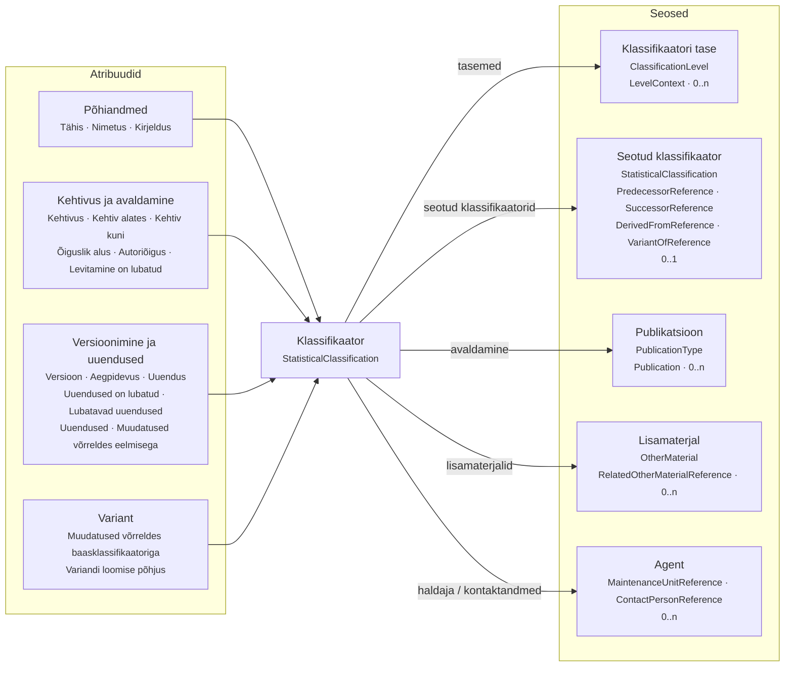
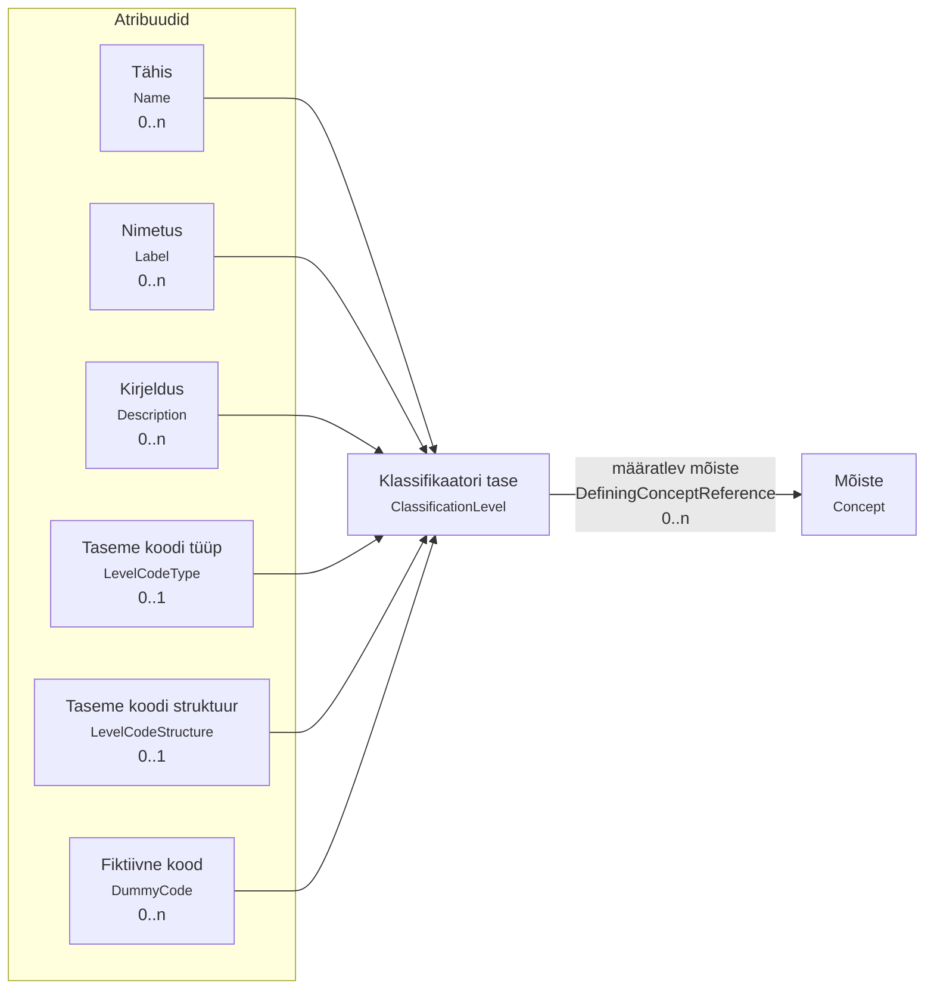
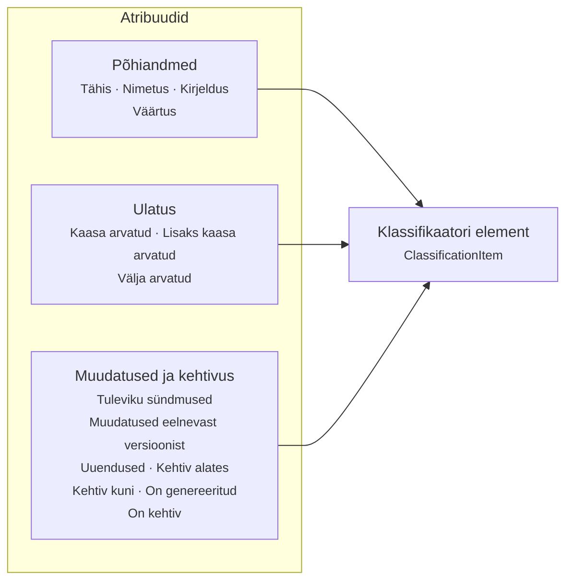

# Klassifikaatorite kirjeldamine

| Standardi osa | [DDI objekt](https://docs.ddialliance.org/DDI-Lifecycle/3.3/model/topics/Classification/) |
|---|---|
| Klassifikaatori perekond | `ClassificationFamily` |
| Klassifikaatorite sari | `ClassificationSeries` |
| Klassifikaator | `StatisticalClassification` |
| Klassifikaatori tase | `ClassificationLevel` |
| Klassifikaatori element | `ClassificationItem` |
| Vastavustabel | `ClassificationCorrespondenceTable` |

## 1. Klassifikaatori perekond
DDI viide: [ClassificationFamily](https://docs.ddialliance.org/DDI-Lifecycle/3.3/model/item-types/ClassificationFamily/)

Klassifikaatori perekond on teatud ühise tunnuse (nt liigitatav valdkond) alusel koondatud rühm klassifikaatorite sarju. Kuna ühtset kokkulepitud klassifikaatorite liigitust ei ole, võivad erinevates andmebaasides olla perekonnad liigitatud erinevatel alustel ja kanda erinevaid nimetusi. Klassifikaatorite sarju ei pea koondama perekondadeks, kuid see hõlbustab nii nende haldamist kui ka kasutamist, andes mh infot, millised klassifikaatorid on mingi tunnuse alusel omavahel seotud.

| # | Atribuudi nimetus | Määratlus | Kohustuslik | Välja tüüp | Mitmesus | Näide |
|---|---|---|---|---|---|---|
| 1 | Tähis (Name) | Klassifikaatorite perekonna unikaalne identifikaator, (lühi)nimi, enamasti lühend nimetusest | Ei | [NameType](https://docs.ddialliance.org/DDI-Lifecycle/3.3/model/composite-types/NameType/) | 0..n | „Geograafia“ valdkonna tähis võib olla „Geo“ vmt |
| 2 | Nimetus (Label) | Valdkonna/perekonna nimetus, mille määrab perekonna/valdkonna haldaja/omanik | **Jah** | [LabelType](https://docs.ddialliance.org/DDI-Lifecycle/3.3/model/composite-types/LabelType/) | 0..n | TOOTED; HARIDUS; AMETID |
| 3 | Kirjeldus (Description) | Klassifikaatorite perekonna sisu ja loomise või kasutamise eesmärki kokku võttev kirjeldus | **Jah** | [StructuredStringType](https://docs.ddialliance.org/DDI-Lifecycle/3.3/model/composite-types/StructuredStringType/) | 0..1 | Klassifikaatorite perekond TOOTED sisaldab klassifikaatoreid, mille alusel liigitatakse tooteid ja teenuseid, arvutatakse ekspordi-, impordi- ja tarbijahinnaindeksit ning kaupade ja teenuste väliskaubanduse näitajaid. |
| 4 | Klassifikaatorite sarjad (ClassificationSeriesReference) | Viide valdkonda kuuluva(te)le klassifikaatori(te) sarja(de)le | **Jah** | [ClassificationSeries](https://docs.ddialliance.org/DDI-Lifecycle/3.3/model/item-types/ClassificationSeries/) | 0..n | Nt Statistikaameti klassifikaatorite perekonda TOOTED kuuluvad järgmised klassifikaatorid: Kombineeritud nomenklatuur; Maksebilansi laiendatud teenuste klassifikaator; Majanduslike põhikategooriate klassifikaator; Standardne väliskaubanduse klassifikaator; Toodete ja teenuste klassifikaator; Tööstustoodete loetelu; Tööstustoodete nimistu; Teenuste väliskaubandus |

## 2. Klassifikaatorite sari
DDI viide: [ClassificationSeries](https://docs.ddialliance.org/DDI-Lifecycle/3.3/model/item-types/ClassificationSeries/)

Sama klassifikaatori versioonid moodustavad sarja. Sarja kuuluvatel klassifikaatori versioonidel on üldjuhul sama nimetus, nt Eesti haldus- ja asustusjaotuse klassifikaator (EHAK). 

| # | Atribuudi nimetus | Määratlus | Kohustuslik | Välja tüüp | Mitmesus | Näide |
|---|---|---|---|---|---|---|
| 1 | Tähis (Name) | Klassifikaatori sarja lühinimi, tavaliselt lühend sarja nimetusest. Tähis võib koosneda tähtedest, numbritest või olla nende kombinatsioon. | **Jah** | [NameType](https://docs.ddialliance.org/DDI-Lifecycle/3.3/model/composite-types/NameType/) | 0..n | AK |
| 2 | Nimetus (Label) | Klassifikaatori sarja nimetus, mille määrab klassifikaatori haldaja või omanik. | **Jah** | [LabelType](https://docs.ddialliance.org/DDI-Lifecycle/3.3/model/composite-types/LabelType/) | 0..n | Ametite klassifikaator |
| 3 | Kirjeldus (Description) | Sarja lühiseloomustus, mis sisaldab eesmärki, peamist kasutusvaldkonda, ülevaadet struktuurist ja seotud klassifikaatoritest vms. | **Jah** | [StructuredStringType](https://docs.ddialliance.org/DDI-Lifecycle/3.3/model/composite-types/StructuredStringType/) | 0..1 | „Ametite klassifikaator“ (AK) on Eesti-sisene klassifikaator, mis põhineb Rahvusvahelise Tööorganisatsiooni (ILO) hallataval klassifikaatoril International Standard Classification of Occupations ISCO-08. Klassifikaatorit kasutatakse selleks, et esitada, võrrelda ja vahetada statistilisi ja administratiivandmeid nii Eestis, Euroopa Liidus kui ka laiemal rahvusvahelisel tasemel. |
| 4 | Kontekst (SeriesContext) | Loomis- ja kasutuskonteksti kirjeldus, nt kas tegemist on Eesti-sisese, rahvusvahelise või muu klassifikaatoriga; viide õiguslikule alusele, standardile või alusdokumendile juhul, kui see on olemas. | Ei | [CodeValueType](https://docs.ddialliance.org/DDI-Lifecycle/3.3/model/composite-types/CodeValueType/) | 0..1 | Eesti-sisene klassifikaator, mis põhineb rahvusvahelisel ISCO klassifikaatoril. |
| 5 | Teema (SubjectArea) | Valdkonnad, kus klassifikaatorit rakendatakse. | Ei | [CodeValueType](https://docs.ddialliance.org/DDI-Lifecycle/3.3/model/composite-types/CodeValueType/) | 0..n | Tööturg; ametid; statistika |
| 6 | Sarja kuuluvad klassifikaatorid (StatisticalClassificationReference) | Viide sarja kuuluvatele klassifikaatoritele. Tavaliselt on kehtiv klassifikaator sarja kuuluvate klassifikaatorite loetelus esimesel kohal ja klassifikaatorid esitatakse ajaliselt kahanevas järjestuses. | **Jah** | [StatisticalClassification](https://docs.ddialliance.org/DDI-Lifecycle/3.3/model/item-types/StatisticalClassification/) | 0..n | Ametite klassifikaator 2008 aegpidev; Ametite klassifikaator 1999 |
| 7 | Kehtiv versioon (CurrentStatisticalClassificationReference) | Viide hetkel kehtivale klassifikaatori versioonile. Viide kehtivale klassifikaatori versioonile võib olla toodud ka eraldi väljal või tähisena selle nimetuse juures. | **Jah** | [StatisticalClassification](https://docs.ddialliance.org/DDI-Lifecycle/3.3/model/item-types/StatisticalClassification/) | 0..1 | Ametite klassifikaator 2008 aegpidev |
| 8 | Omanik (OwnerReference) | Viide organisatsioonile, kes vastutab sarja kuuluvate klassifikaatorite koostamise ja haldamise eest. | **Jah** | [Agent](https://docs.ddialliance.org/DDI-Lifecycle/3.3/model/topics/Agent/) | 0..n | Statistikaamet |

## 3. Klassifikaator

DDI viide: [StatisticalClassification](https://docs.ddialliance.org/DDI-Lifecycle/3.3/model/item-types/StatisticalClassification/)

Klassifikaatoreid hallatakse kas versioonidena (sisuliste muudatuste korral luuakse uus versioon) või aegpidevana (muudatused tehakse alati samas versioonis ilma uut versiooni loomata, igal elemendil peab olema määratud kehtivuse alguse kuupäev ning kehtetuks tunnistatud elementidel ka kehtivuse lõppkuupäev). Kirjeldatavad atribuudid sõltuvad mõningal määral haldamise viisist.

Kui klassifikaatorist on vaja kasutada ainult osa, nt üht taset või lisada mõned täiendavad koodid (nt kasutada EHAKist ainult maakondi ja Tallinna), siis saab kasutamise hõlbustamiseks teha sellest variandi.

| # | Atribuudi nimetus | Määratlus | Kohustuslik | Välja tüüp | Mitmesus | Näide |
|---|---|---|---|---|---|---|
| 1 | Tähis (Name) | Klassifikaatoril on unikaalne tähis, mis tavaliselt on lühend nimetusest. Sageli eristatakse ühe sarja eri klassifikaatoreid kas versiooni numbri või kehtima hakkamise aastaarvuga. Kui klassifikaatori versioon muutub ühes aastas mitu korda, lisatakse ka versiooni järjekorranumber. Hea tava on tähises tühikuid mitte kasutada. | **Jah** | [NameType](https://docs.ddialliance.org/DDI-Lifecycle/3.3/model/composite-types/NameType/) | 0..n | AK2008ap; EHAK2023v1 |
| 2 | Nimetus (Label) | Klassifikaatori nimetus, mille määrab omanik või haldaja. | **Jah** | [LabelType](https://docs.ddialliance.org/DDI-Lifecycle/3.3/model/composite-types/LabelType/) | 0..n | Eesti haldus- ja asustusjaotuse klassifikaator 2017 aegpidev; Eesti majanduse tegevusalade klassifikaator |
| 3 | Kirjeldus (Description) | Klassifikaatori lühiiseloomustus. | **Jah** | [StructuredStringType](https://docs.ddialliance.org/DDI-Lifecycle/3.3/model/composite-types/StructuredStringType/) | 0..1 | Ametite klassifikaatoris on ametid liigitatud selgelt määratletud rühmadesse töö sisu, tööga seotud ülesannete ja nõutava kvalifikatsiooni alusel. |
| 4 | Kehtivus (IsCurrent) | Viide, kas klassifikaator on hetkel kehtiv. | **Jah** | `boolean` | 0..1 | Jah |
| 5 | Kehtiv alates (ReleaseDate) | Kuupäev, millest alates on klassifikaator kehtiv. | **Jah** | `kuupäev` | 0..1 | 2017-12-01 |
| 6 | Kehtiv kuni (TerminationDate) | Klassifikaatori kehtivuse viimane kuupäev. Kohustuslik juhul, kui klassifikaatori versioon on kehtetu. | Ei | `kuupäev` | 0..1 |  |
| 7 | Õiguslik alus (LegalBase) | Viide, millise õigusaktiga või muu kokkuleppega on klassifikaator kinnitatud või mille alusel loodud. | **Jah** | [StructuredStringType](https://docs.ddialliance.org/DDI-Lifecycle/3.3/model/composite-types/StructuredStringType/) | 0..n | Riigihalduse ministri 11. oktoobri 2017. a määruse nr 72 „Asustusüksuste nimistu kinnitamine ning nende lahkmejoonte määramine” muutmine [(RT I, 30.05.2025, 6)](https://www.riigiteataja.ee/akt/130052025006). |
| 8 | Autoriõigus (Copyright) | Klassifikaatoril võivad olla piiratud autoriõigused, näiteks ei ole neid võimalik alla laadida. Ametlikes väljaannetes tuleb viidata autoriõiguste omanikule. | Ei | [InternationalStringType](https://docs.ddialliance.org/DDI-Lifecycle/3.3/model/composite-types/InternationalStringType/) | 0..1 |  |
| 9 | Avaldamine (Publication) | Viide dokumendile, veebilehele või muule väljaandele, kus klassifikaator on avaldatud. | Ei | [PublicationType](https://docs.ddialliance.org/DDI-Lifecycle/3.3/model/composite-types/PublicationType/) | 0..n | Kui klassifikaatori haldamine ja avaldamine toimub erinevates keskkondades, siis viide veebilehele, kus klassifikaator on leitav. |
| 10 | Levitamine on lubatud (IsDisseminationAllowed) | Näitab, kas klassifikaatorit tohib avaldada elektrooniliselt, trükitult või muul viisil. | Ei | `boolean` | 0..1 | Jah |
| 11 | Tasemed (LevelContext) | Klassifikaatori struktuuri tasemete kirjeldus või link kohale, kus klassifikaatori tasemed on kirjeldatud. | **Jah** | [LevelContextType](https://docs.ddialliance.org/DDI-Lifecycle/3.3/model/composite-types/LevelContextType/) | 0..n | 1 AK pearühm – 1-kohaline kood; 2 AK allpearühm – 2-kohaline kood; 3 AK allrühm – 3-kohaline kood; 4 AK ametirühm – 4-kohaline kood; 5 AK ametinimetus – 8-kohaline kood |
| 12 | Eelnev klassifikaator (PredecessorReference) | Nende klassifikaatorite puhul, mis on versioonid või uuendused, viide eelnevale klassifikaatorile või versioonile, mille järglane antud klassifikaator on. | Ei | [StatisticalClassification](https://docs.ddialliance.org/DDI-Lifecycle/3.3/model/item-types/StatisticalClassification/) | 0..1 |  |
| 13 | Järgnev klassifikaator (SuccessorReference) | Nende klassifikaatorite puhul, mis on versioonid või uuendused, viide järgmisele kehtivale klassifikaatorile või selle versioonile. | Ei | [StatisticalClassification](https://docs.ddialliance.org/DDI-Lifecycle/3.3/model/item-types/StatisticalClassification/) | 0..1 |  |
| 14 | Lähteklassifikaator (DerivedFromReference) | Näitab klassifikaatori versiooni, millest antud klassifikaator on tuletatud. | Ei | [StatisticalClassification](https://docs.ddialliance.org/DDI-Lifecycle/3.3/model/item-types/StatisticalClassification/) | 0..1 | Rahvusvaheline ametite klassifikaator ISCO-08 |
| 15 | Muudatused võrreldes eelmisega (ChangesFromPreceding) | Kokkuvõte muudatuste olemusest või sisust võrreldes eelmise versiooni või uuendusega. | Ei | [StructuredStringType](https://docs.ddialliance.org/DDI-Lifecycle/3.3/model/composite-types/StructuredStringType/) | 0..1 |  |
| 16 | Lisamaterjalid (RelatedOtherMaterialReference) | Viide lisamaterjalidele, näiteks failidele kas klassifikaatori enda või selgitavate märkustega. | Ei | [OtherMaterial](https://docs.ddialliance.org/DDI-Lifecycle/3.3/model/item-types/OtherMaterial/) | 0..n | Klassifikaator .xlsx-failina |
| 17 | Versioon (IsVersion) | Viide, kas klassifikaator on versioon. | Ei | `boolean` | 0..1 |  |
| 18 | Aegpidevus (IsFloating) | Viide, kas klassifikaator on aegpidev. | Ei | `boolean` | 0..1 | Jah |
| 19 | Uuendus (IsUpdate) | Viide, kas klassifikaator on uuendus. | Ei | `boolean` | 0..1 | Ei |
| 20 | Uuendused on lubatud (UpdatesAllowed) | Viide, kas klassifikaatori versioonis on lubatud teha uuendusi ilma uut versiooni loomata. | Ei | `boolean` | 0..1 | Jah |
| 21 | Lubatavad uuendused (PermissibleUpdates) | Kirjeldus selle kohta, missugused muudatused on lubatud versiooni sees nii, et klassifikaatorist ei looda uut versiooni. Näiteks aegpideva klassifikaatori korral viide, et klassifikaatorisse on lubatud lisada uusi elemente. | Ei | [StructuredStringType](https://docs.ddialliance.org/DDI-Lifecycle/3.3/model/composite-types/StructuredStringType/) | 0..1 |  |
| 22 | Uuendused (Updates) | Pärast uue klassifikaatori versiooni või klassifikaatori uuenduse jõustumist toimunud muudatuste kokkuvõtlik kirjeldus. Kui muudatusi on palju, võib need kirjeldada ka eraldi failis ja siia lisada lingi dokumendile. | Ei | [StructuredStringType](https://docs.ddialliance.org/DDI-Lifecycle/3.3/model/composite-types/StructuredStringType/) | 0..1 |  |
| 23 | Alusklassifikaator (VariantOfReference) | Nende klassifikaatorite puhul, mis on variandid, viide klassifikaatorile, mille variandiks see on. | Ei | [StatisticalClassification](https://docs.ddialliance.org/DDI-Lifecycle/3.3/model/item-types/StatisticalClassification/) | 0..1 |  |
| 24 | Muudatused võrreldes baasklassifikaatoriga (VariantChangesFromBase) | Klassifikaatori variandis alusklassifikaatoriga võrreldes tehtud muudatused, variandi ja baasklassifikaatori vahelist seost, sh rühmitamiste, lisatud koondavate või laiendavate elementide kirjeldus. | Ei | [StructuredStringType](https://docs.ddialliance.org/DDI-Lifecycle/3.3/model/composite-types/StructuredStringType/) | 0..1 |  |
| 25 | Variandi loomise põhjus (VariantPurpose) | Kui klassifikaator on variant, siis kirjeldatakse selle loomise põhjus. | Ei | [StructuredStringType](https://docs.ddialliance.org/DDI-Lifecycle/3.3/model/composite-types/StructuredStringType/) | 0..1 |  |
| 26 | Haldaja (MaintenanceUnitReference) | Organisatsioon või üksus, kes vastutab klassifikaatori haldamise, st selle uuendamise ja muutmise eest. | **Jah** | [Agent](https://docs.ddialliance.org/DDI-Lifecycle/3.3/model/topics/Agent/) | 0..n | Statistikaamet |
| 27 | Kontaktandmed (ContactPersonReference) | Haldaja kontaktandmed täiendava info saamiseks klassifikaatori kohta. | **Jah** | [Agent](https://docs.ddialliance.org/DDI-Lifecycle/3.3/model/topics/Agent/) | 0..n | klassifikaatorid@stat.ee |

## 4. Klassifikaatori tase

DDI viide: [ClassificationLevel](https://docs.ddialliance.org/DDI-Lifecycle/3.3/model/item-types/ClassificationLevel/)

Struktuuri järgi on klassifikaatorid kas hierarhilised või lineaarsed. Lineaarne klassifikaator koosneb ühest tasemest ja seda kasutatakse juhul, kui kategooriaid ei ole vaja rühmitada. Hierarhiline klassifikaator on mitme tasemega klassifikaator.

| # | Atribuudi nimetus | Määratlus | Kohustuslik | Välja tüüp | Mitmesus | Näide |
|---|---|---|---|---|---|---|
| 1 | Tähis (Name) | Taseme tähis või lühinimi. | Ei | [NameType](https://docs.ddialliance.org/DDI-Lifecycle/3.3/model/composite-types/NameType/) | 0..n | mk; omavalitsus; asutusüksus |
| 2 | Nimetus (Label) | Taseme nimetus, mis kuvatakse kasutajale. | **Jah** | [LabelType](https://docs.ddialliance.org/DDI-Lifecycle/3.3/model/composite-types/LabelType/) | 0..n | EHAK maakond; EHAK omavalitsusüksus; EHAK asustusüksus |
| 3 | Kirjeldus (Description) | Taseme sisu ja eesmärgi kirjeldus. Siin ei dubleerita koodi struktuuri, vaid selgitatakse, mida vastav tase klassifikaatoris tähistab. | Ei | [StructuredStringType](https://docs.ddialliance.org/DDI-Lifecycle/3.3/model/composite-types/StructuredStringType/) | 0..n | Kõrgeim haldusjaotuse tase |
| 4 | Taseme koodi tüüp (LevelCodeType) | Näitab, kas taseme kood on täheline, numbriline või tähtnumbriline.| **Jah** | [CodeValueType](https://docs.ddialliance.org/DDI-Lifecycle/3.3/model/composite-types/CodeValueType/) | 0..1 | numberkood araabia numbritega; tähtkood; tähtnumberkood |
| 5 | Taseme koodi struktuur (LevelCodeStructure) | Näitab, mitmekohaline kood on ning kuidas taseme kood koosneb numbritest, tähtedest ja eraldajatest. | **Jah** | [CodeValueType](https://docs.ddialliance.org/DDI-Lifecycle/3.3/model/composite-types/CodeValueType/) | 0..1 | 4-kohaline numberkood; 2-kohaline tähtkood; 3-kohaline punktiga eraldatud numberkood |
| 6 | Fiktiivne kood (DummyCode) | Reegel fiktiivsete (klassifikaatori struktuuri mitte kuuluvate) koodide konstrueerimiseks järgmise kõrgema taseme koodidest. Kasutatakse nt juhul, kui klassifikaatori struktuuri korrektseks kuvamiseks on vaja tehnilist koodi (st klassifikaatori struktuuris on koodideta vahetasemed). | Ei | [StructuredStringType](https://docs.ddialliance.org/DDI-Lifecycle/3.3/model/composite-types/StructuredStringType/) | 0..n | |
| 7 | Viide määratlevale mõistele (DefiningConceptReference) | Viide mõistele, mis kirjeldab või defineerib klassifikaatori taset. | Ei | [Concept](https://docs.ddialliance.org/DDI-Lifecycle/3.3/model/item-types/Concept/) | 0..n | |

## 5. Klassifikaatori element

DDI viide: [ClassificationItem](https://docs.ddialliance.org/DDI-Lifecycle/3.3/model/item-types/ClassificationItem/)

Klassifikaatori element tähistab klassifikaatori kindlal tasemel paiknevat kategooriat ning kirjeldab selle kategooria ulatust ja eristamist teistest kategooriatest.

### 5.1. Klassifikaatori elemendi atribuudid

| # | Atribuudi nimetus | Määratlus | Kohustuslik | Välja tüüp | Mitmesus | Näide |
|---|---|---|---|---|---|---|
| 1 | Tähis (Name) | Klassifikaatori elemendi lühinimi. | Ei | [NameType](https://docs.ddialliance.org/DDI-Lifecycle/3.3/model/composite-types/NameType/) | 0..n |  |
| 2 | Nimetus (Label) | Klassifikaatori elemendi või kategooria nimetus. Nimetus on unikaalne selles klassifikaatoris, kuhu element kuulub, v.a juhul, kui hierarhilise klassifikaatori elemendid on erinevatel tasemetel identsed, st hierarhilisel klassifikaatoril kõrgeimal (agregeeritumal) tasemel olev klassifikaatori element ei jagune detailsemaks, aga klassifikaatori struktuuri tagamiseks korratakse seda elementi madalamatel tasemetel. Nimetus peab olema tähenduslik, selgitama kategooria täpset sisu. | **Jah** | [LabelType](https://docs.ddialliance.org/DDI-Lifecycle/3.3/model/composite-types/LabelType/) | 0..n | Elamute ja mitteeluhoonete ehitus |
| 3 | Kirjeldus (Description) | Klassifikaatori elemendi sisu ja eesmärgi kirjeldus. | Ei | [StructuredStringType](https://docs.ddialliance.org/DDI-Lifecycle/3.3/model/composite-types/StructuredStringType/) | 0..1 | Siia klassi kuuluvad elamute või mitteeluhoonete ehitamine ning juurde- ja ümberehitustööd. |
| 4 | Väärtus (ItemCode / Value) | Klassifikaatori elementi tähistav täht-, number- või tähtnumbriline kood, mis on kooskõlas vastava taseme koodistruktuuriga. Kood on unikaalne selles klassifikaatoris, millesse klassifikaatori element kuulub. | **Jah** | `string` | 0..1 | 41.00 |
| 5 | Kaasa arvatud (Includes) | Klassifikaatori elemendi või kategooria sisu täpsustus. | Ei | [StructuredStringType](https://docs.ddialliance.org/DDI-Lifecycle/3.3/model/composite-types/StructuredStringType/) | 0..1 | Siia klassi kuulub: igat tüüpi hoonete ehitamine: elamud; tööstus- ja tootmishooned, nt tehased, töökojad jms; haiglad, koolid ja kontorihooned; hotellid, poed, kaubanduskeskused ja restorani; lennujaamahooned; spordihooned; parkimismajad, k.a maa-alused; laohooned; sakraalehitised; kohapeal kokkupanemist vajavate elementhoonete püstitamine |
| 6 | Lisaks kaasa arvatud (IncludesAlso) | Kirjeldatud kategooriasse kuuluvate piiripealsete juhtumite loetelu. | Ei | [StructuredStringType](https://docs.ddialliance.org/DDI-Lifecycle/3.3/model/composite-types/StructuredStringType/) | 0..1 | Siia klassi kuulub ka olemasolevate elamute või mitteeluhoonete täielik ümberehitus või renoveerimine. |
| 7 | Välja arvatud (Excludes) | Kirjeldatud kategooriasse mittekuuluvate juhtumite loetelu. Võib sisaldada viidet klassifikaatori elemendile, kuhu vastavad juhtumid liigitatakse. | Ei | [StructuredStringType](https://docs.ddialliance.org/DDI-Lifecycle/3.3/model/composite-types/StructuredStringType/) | 0..1 | Siia klassi ei kuulu tööstusrajatiste, v.a hoonete ehitamine; ehitusprojektide arendamine; arhitektuuri- ja insenertegevus. |
| 8 | Tuleviku sündmused (FutureEvents) | Klassifikaatori elemendiga seotud tulevaste muudatuste kirjeldus. | Ei | [StructuredStringType](https://docs.ddialliance.org/DDI-Lifecycle/3.3/model/composite-types/StructuredStringType/) | 0..1 |  |
| 9 | Muudatused eelnevast versioonist (ChangesFromPriorVersion) | Kirjeldab muudatusi, mille suhtes klassifikaatori element on võrreldes eelmise versiooniga muutunud. | Ei | [StructuredStringType](https://docs.ddialliance.org/DDI-Lifecycle/3.3/model/composite-types/StructuredStringType/) | 0..1 |  |
| 10 | Uuendused (Updates) | Kirjeldab muudatusi, mis on klassifikaatori kehtivusajal klassifikaatori elemendiga tehtud. | Ei | [StructuredStringType](https://docs.ddialliance.org/DDI-Lifecycle/3.3/model/composite-types/StructuredStringType/) | 0..1 |  |
| 11 | Kehtiv alates (ValidFrom) | Klassifikaatori elemendi kehtivuse alguse kuupäev. Kuupäev tuleb määratleda, kui klassifikaatori element kuulub aegpidevasse klassifikaatorisse. Kuupäeva vorming ei ole üheselt ette määratud, vaid sõltub andmekogu või andmekirjelduste haldajate kokkulepetest. | Tingimuslik | `kuupäev` | 0..1 | 2017-12-01 |
| 12 | Kehtiv kuni (ValidTo) | Klassifikaatori elemendi kehtetuks tunnistamise kuupäev. Kuupäev tuleb määratleda, kui klassifikaatori element kuulub aegpidevasse klassifikaatorisse ja see ei ole enam kehtiv. Kuupäeva vorming ei ole üheselt ette määratud, vaid sõltub andmekogu või andmekirjelduste haldajate kokkulepetest. | Tingimuslik | `kuupäev` | 0..1 | 2023-12-31 |
| 13 | On genereeritud (IsGenerated) | Märkeruut, mida kasutatakse juhul, kui klassifikaatorisse on struktuuri hoidmiseks lisatud koode, mis ei kuulu klassifikaatori struktuuri (nn „dummy“ koodid). | Ei | `boolean` | 0..1 | Jah |
| 14 | On kehtiv (IsValid) | Märkeruut, mis näitab, kas klassifikaatori element on hetkel kehtiv. | Ei | `boolean` | 0..1 | Jah |

### 5.2. Täiendavad atribuudid

Kui klassifikaatoris on täiendavaid andmevälju, siis võib klassifikaatori kirjeldamiseks võib olla vajalik lisada ka täiendavaid atribuute, mis ei ole DDI `ClassificationItem` põhiatribuudid.

| # | Atribuudi nimetus | Määratlus | Kohustuslik | Välja tüüp | Mitmesus | Näide |
|---|---|---|---|---|---|---|
| 1 | Mõõtühik (Measurement Unit) | Vajadusel saab lisada kategooriale mõõtühiku, milles antud objekti/üksust mõõdetakse. | Ei | Kontrollsõnastik / mitmekeelne tekst | 0..n | kg; euro; protsent |

## 6. Klassifikaatori vastavustabel

DDI viide: [ClassificationCorrespondenceTable](https://docs.ddialliance.org/DDI-Lifecycle/3.3/model/item-types/ClassificationCorrespondenceTable/)

Klassifikaatori vastavustabel väljendab seost kahe klassifikaatori vahel.

### 6.1. Klassifikaatori vastavustabeli atribuudid

| # | Atribuudi nimetus | Määratlus | Kohustuslik | Välja tüüp | Mitmesus | Näide |
|---|---|---|---|---|---|---|
| 1 | Tähis (Name) | Vastavustabeli tähis või lühinimi. | Ei | [NameType](https://docs.ddialliance.org/DDI-Lifecycle/3.3/model/composite-types/NameType/) | 0..n | EHAK2019v1_vs_EHAK2019v2 |
| 2 | Nimetus (Label) | Vastavustabeli nimetus. | **Jah** | [LabelType](https://docs.ddialliance.org/DDI-Lifecycle/3.3/model/composite-types/LabelType/) | 0..n | Vastavustabel EHAK2019v1 ja EHAK2019v2 vahel |
| 3 | Kirjeldus (Description) | Vastavustabeli sisu ja eesmärgi kirjeldus. | Ei | [StructuredStringType](https://docs.ddialliance.org/DDI-Lifecycle/3.3/model/composite-types/StructuredStringType/) | 0..1 | Vastavustabel kirjeldab uue ja eelmise EHAK-i versiooni koodide vahelisi vastavusi. |
| 4 | Omanikud (OwnerReference / Owners) | Viide organisatsioonile või isikule, kes on vastavustabeli omanik. | Ei | [Agent](https://docs.ddialliance.org/DDI-Lifecycle/3.3/model/topics/Agent/) | 0..n | Statistikaamet |
| 5 | Haldajad (MaintenanceUnitReference / Maintenance Units) | Viide organisatsioonile või isikutele, kes vastutavad vastavustabeli haldamise ja uuendamise eest. | Ei | [Agent](https://docs.ddialliance.org/DDI-Lifecycle/3.3/model/topics/Agent/) | 0..n | Statistikaamet |
| 6 | Kontaktisikud (ContactPersonReference / Contact People) | Viide kontaktisikule või kontaktisikutele, kelle poole saab vastavustabeli kohta lisainfo saamiseks pöörduda. | Ei | [Agent](https://docs.ddialliance.org/DDI-Lifecycle/3.3/model/topics/Agent/) | 0..n | klassifikaatorid@stat.ee |
| 7 | Publikatsioonid (Publication / Publications) | Viide dokumendile, veebilehele või väljaandele, kus vastavustabel on avaldatud. | Ei | [PublicationType](https://docs.ddialliance.org/DDI-Lifecycle/3.3/model/composite-types/PublicationType/) | 0..n | Vastavustabeli avaldamise veebileht |
| 8 | Aegpideva vastavuse kuupäev (FloatingMapDate) | Kuupäev, mis tuleb märkida juhul, kui lähte- ja/või sihtklassifikaator on aegpidev. Vastavustabel väljendab kahe klassifikaatori seoseid sellisena, nagu need eksisteerisid täpsustatud kuupäeval. | Tingimuslik | `kuupäev` | 0..1 | 2019-04-15 |

### 6.2. Lähte- ja sihtklassifikaatorid

| # | Atribuudi nimetus | Määratlus | Kohustuslik | Välja tüüp | Mitmesus | Näide |
|---|---|---|---|---|---|---|
| 1 | Lähteklassifikaator (SourceClassificationReference / Source Classification) | Viide statistilisele klassifikaatorile, millest vastavus tehakse. | **Jah** | [StatisticalClassification](https://docs.ddialliance.org/DDI-Lifecycle/3.3/model/item-types/StatisticalClassification/) | 0..1 | EHAK2019v1 |
| 2 | Sihtklassifikaator (TargetClassificationReference / Target Classification) | Viide sihtklassifikaatorile ehk klassifikaatorile, millele vastavus on suunatud. | **Jah** | [StatisticalClassification](https://docs.ddialliance.org/DDI-Lifecycle/3.3/model/item-types/StatisticalClassification/) | 0..n | EHAK2019v2 |
| 3 | Lähtetase (SourceLevelReference / Source Level) | Viide lähteklassifikaatori tasemele, mille piires vastavus koostatakse. Kui taset ei näidata, saab sihtklassifikaatori elemente määrata igale lähteklassifikaatori tasemele. | Ei | [ClassificationLevel](https://docs.ddialliance.org/DDI-Lifecycle/3.3/model/item-types/ClassificationLevel/) | 0..1 | 3. tase |
| 4 | Sihttase (TargetLevelReference / Target Level) | Viide sihtklassifikaatori tasemele, mille piires vastavus koostatakse. Kui taset ei näidata, saab lähteklassifikaatori elemente määrata sihtklassifikaatori mis tahes tasemele. | Ei | [ClassificationLevel](https://docs.ddialliance.org/DDI-Lifecycle/3.3/model/item-types/ClassificationLevel/) | 0..1 | 3. tase |
| 5 | Kardinaalsus (RelationshipMappingType / Cardinality) | Määrab lähte- ja sihtklassifikaatori elementide vahelise suhte tüübi. Vastavustabelis võib määratleda 1:1 (üks ühele), 1:N (üks mitmele), N:1 (mitu ühele) või M:N (mitu mitmele) suhte. | Ei | [CodeValueType](https://docs.ddialliance.org/DDI-Lifecycle/3.3/model/composite-types/CodeValueType/) | 0..1 | 1:1 |

### 6.3. Vastendus/kaardistus

Kaardistus ehk vastendus väljendab seost lähteklassifikaatori elemendi ja sihtklassifikaatori elemendi vahel. Vastendus peaks täpsustama, kas kahe klassifikaatori elemendi vaheline seos on osaline või täielik. Sõltuvalt vastavustabeli seose tüübist võib ühe lähte- või sihtklassifikaatori elemendi kohta olla mitu vastendust. DDI-s vastab sellele  [ClassificationMapType](https://docs.ddialliance.org/DDI-Lifecycle/3.3/model/composite-types/ClassificationMapType/?highlight=classificationmaptype).

| # | Atribuudi nimetus | Määratlus | Kohustuslik | Välja tüüp | Mitmesus | Näide |
|---|---|---|---|---|---|---|
| 1 | Lähteelement (SourceClassificationItemReference / Source Item) | Viide klassifikaatori elemendile lähteklassifikaatoris. | **Jah** | [ClassificationItem](https://docs.ddialliance.org/DDI-Lifecycle/3.3/model/item-types/ClassificationItem/) | 0..1 | Keila-Joa alevik |
| 2 | Sihtelement (TargetClassificationItemReference / Target Item) | Viide klassifikaatori elemendile sihtklassifikaatoris. | **Jah** | [ClassificationItem](https://docs.ddialliance.org/DDI-Lifecycle/3.3/model/item-types/ClassificationItem/) | 0..1 | Keila-Joa alevik |
| 3 | On lõplik (IsComplete) | Märkeruut, mis määrab, kas kahe klassifikaatori elemendi vaheline seos on osaline või täielik. | Ei | `boolean` | 0..1 | Jah |
| 4 | Kehtiv alates (ValidFrom) | Kuupäev, millest alates vastendus kehtib. Kuupäev tuleb määrata, kui vastendus kuulub aegpidevasse vastavustabelisse. | Tingimuslik | `kuupäev` | 0..1 | 2019-04-15 |
| 5 | Kehtiv kuni (ValidTo) | Kuupäev, mil vastendus muutus kehtetuks. Kuupäev tuleb määrata, kui vastendus kuulub aegpidevasse vastavustabelisse ja see ei ole enam kehtiv. | Tingimuslik | `kuupäev` | 0..1 |  |